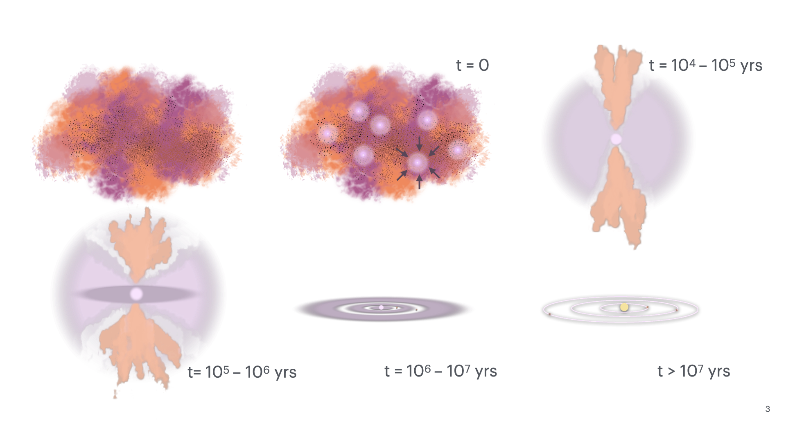

<h1> How do stars form? </h1>

<figure>
  
  <figcaption>Cartoon drawn by me, please credit if you use.</figcaption>
</figure>

Body here describing star formation

<h1> The efficiency issue </h1>

<!-- <figure>
  
  
  <figcaption>Free-fall efficiency determined following the work of Pokhrel et al. 2021</figcaption>
</figure> -->

Body here describing this issue

<h1> Webb to the rescue! </h1>

Body here describing Webb's impact.