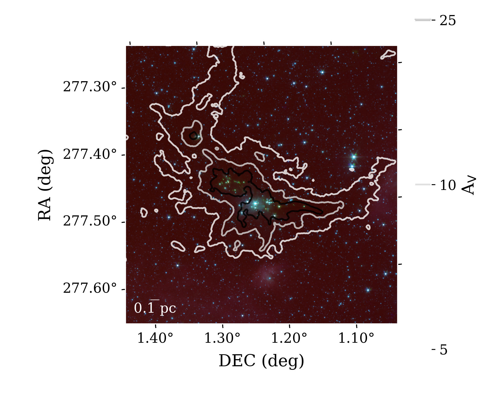
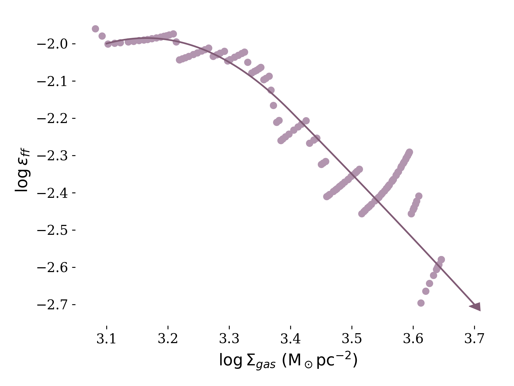

<h1> How efficently do stars form? </h1>

<figure>
  
  <figcaption>Cartoon drawn by me, please credit if you use.</figcaption>
</figure>

Stars form from giant clouds of molecular gas and dust over millions of years, but how much of the initial material in a cloud actually ends up in a star? In the above figure, we see that stars undergo many different observational stages before they begin hydrogen fusion and start their journey on the main sequence. There are many places along this journey where the number of stars made from this gas can be changed.

At the core stage (going from the upper left panel to the upper middle), cores can be formed and ripped apart by turbulent motions within the gas, before they can go from starless to pre-stellar. 

In the protostar stage (upper right to lower left) the accretion onto the central source can cause fragmentation into multiple star systems, and the strong outflows can increase turblence in the area making it more difficult to form stars, and blow away material that was being accreted onto the central star. Indeed, many processes can impact the shift seen from the core mass function to the initial mass function. 

My work focuses on connecting the amount of gas within a given region to the number of protostars within that region. Understanding the number of stars we can finally expect from a given cloud, and how that might vary with environment, can help us to understand the relative impact of different feedback effects on the star formation rate.

<h1> The efficiency issue </h1>

<figure>
  
  
  <figcaption>Free-fall efficiency for Serpens Main determined following the work of Pokhrel et al. 2021; Spitzer data from C2D survey, Herschel data from the Herschel Gould Belt Survey. Column densities are indicated with contours, RGB image is built from IRAC 1, 2, and 4 bands. Number of protostars pulled from the C2D catalog of Serpens Main, following cuts in spectral index. Stochastic nature of the scatter plot is due to the few (38) YSOs within this section of the field.</figcaption>
</figure>

In a previous work by Pokhrel et al. (2021), it was found that the star formation efficiency (how many stars are made from the available gas) is fairly steady at about 2.6%, up to a gas surface density of about 1&#215;1022 particles cm-2. After this density, the number of protostars within the gas surface density contours drops off precipitously, causing a similar drop in star forming efficiency. The cause? A couple possibilities:
<ol>
  <li>Observational Bias</li>
  <li>Feedback Effects</li>
</ol>
Observational biases arise when the telescope used is unable to probe the full depth of the cloud. Since protostars are born deep within the cloud, the intervening gas and dust can obscure these objects. Furthermore, resolution limitations mean that many stars in more distant regions may be unresolved binaries, or simply unresolved stars along the same line of sight. 

On the other hand, feedback, as noted before, is capable of disrupting core formation and can blow out material from accreting onto protostars. 

To differentiate between these effects, we require a telescope which is unhindered by observational biases: cue the <i>James Webb</i> Space Telescope (JWST).

JWST has a resolution 10x that of Spitzer (the previous infra-red space telescope), and can detect objects that are 60x dimmer (based on their mirror sizes alone). Furthermore, JWST has filters specifically tuned to signatures arising from outflows, thus allowing for the accurate determination of feedback effects. With the data from this telescope, we will be able to determine what the true star formation efficiency is in dense environments, and how it might change with environment.